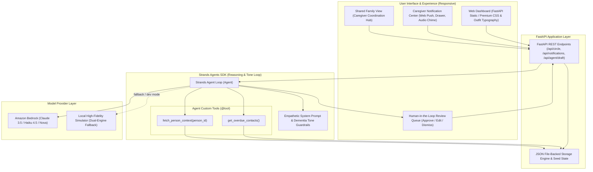

# RealCare 🌿
> **AWS "Agents for Humans" Hackathon • Good Neighbor Agents Track**  
> Built with the **Strands Agents SDK** (Amazon Bedrock & Claude 3.5 Sonnet / Haiku / Nova)

RealCare is an empathetic, proactive AI Caregiver & Recall Agent designed to help people maintain authentic emotional bonds with loved ones they've drifted from due to busy schedules or distance. It places special emphasis on families supporting relatives navigating memory challenges (such as mild cognitive impairment or dementia), where consistent, grounding connection is vital and care responsibility should never fall on a single person alone.

---

## 🌟 Core Features

1. **Proactive Caregiver Notification Center**:
   - **Real-Time Overdue Tracking**: The agent continuously monitors contact frequencies (e.g., 3 days for grandmother with memory care needs, 14 days for ICU resident brother).
   - **Native Browser Push Alerts**: Using the HTML5 Notification API, caregivers receive desktop and mobile alerts even when RealCare is in the background.
   - **In-App Notification Drawer**: Centralized notification center with urgency badges (High Alert, Gentle Reminder, Family Touchpoint), audio chime feedback, and one-click draft review.
   - **Multi-Channel Dispatch Simulation**: Demonstrates SMS, WhatsApp, and Family Digest dispatch.

2. **The "Care Circle" Data Model**:
   - Structured profiles for loved ones with configurable check-in frequencies and preferred channels (Phone, SMS, In-Person).
   - Rich "Memory & Connection Anchors" (cherished stories, hobbies, daily routines, favorite tea, pets).
   - Dynamic health score calculation engine (`last_contact_date` vs `checkin_frequency_days`).

3. **Strands Recall Agent**:
   - Built with the official **Strands Agents SDK** (`strands-agents`).
   - Agent custom tools: `@tool get_overdue_contacts`, `@tool fetch_person_context`.
   - Autonomous scanning that analyzes your care circle and surfaces loved ones in need of connection.

4. **Fact-Grounded Personalized Check-ins (No Generic Templates)**:
   - Rather than bland *"Hey, thinking of you"*, the agent crafts rich, specific messages grounded in stored memories.
   - For relatives with memory challenges: anchors in sensory routines (tea time, blue hydrangeas) while intentionally avoiding stressful memory quizzes.
   - Transparent agent reasoning explaining why specific details and communication channels were chosen.

5. **Human-in-the-Loop (HITL) Approval Queue**:
   - The user retains complete agency.
   - Review, edit, approve, or discard drafted messages before they are marked as sent.
   - Approving simulates sending and automatically resets the contact timer.

6. **Shared Family View**:
   - Dedicated coordination hub for loved ones with memory challenges (e.g., Eleanor Vance, 81).
   - Shows real-time cadence and timeline of family visits and calls across siblings and grandchildren.
   - Prevents caregiver burnout and ensures connection is shared.

7. **Modern, Responsive Glassmorphic Dashboard**:
   - Polished design with Google Fonts (`Outfit`, `Plus Jakarta Sans`, `Fraunces`), ambient radial glow gradients, subtle micro-interactions, and mobile navigation tabs.

---

## 🚀 Quick Start

### 1. Requirements
- Python 3.10+ (Tested on Python 3.14)
- No Node.js build steps needed!

### 2. Environment Setup
The project virtual environment is pre-configured in `.venv`. To run directly:

```bash
# Optional: inspect or modify .env
cp .env.example .env
```

### 3. Launching the App
Simply run:
```bash
.venv\Scripts\python run.py
```
Or:
```bash
py run.py
```

Then open your browser to:
👉 **`http://127.0.0.1:8000`**

---

## ⚙️ Configuration & AWS Bedrock

RealCare includes a **dual-engine architecture**:
- **Simulator / Local Testing Mode** (`USE_MOCK_AGENT=true`): Runs instantly out of the box with zero cloud API keys needed, perfect for local development, UI testing, and video demos.
- **Amazon Bedrock Live Mode** (`USE_MOCK_AGENT=false`): Connects the Strands Agent to Amazon Bedrock (e.g. `anthropic.claude-haiku-4-5-20251001-v1:0` or Amazon Nova) using standard AWS IAM credentials.

In `.env`:
```ini
AWS_REGION=us-east-1
BEDROCK_MODEL_ID=us.anthropic.claude-haiku-4-5-20251001-v1:0
USE_MOCK_AGENT=true
PORT=8000
```

---

## 🏗️ Architecture Diagram



---

## 🔔 How Do Caregivers Receive Notifications?

RealCare provides a multi-channel notification approach:

1. **Native Desktop / Mobile Push**:
   - Clicking **"Enable"** in the Notification Drawer activates HTML5 Web Notifications.
   - When an agent scan detects that someone has drifted or an upcoming care window approaches, a system notification banner pops up with direct action links.
2. **In-App Care Notification Center**:
   - An animated bell icon in the top header displays an unread counter badge.
   - Clicking the bell slides open the **RealCare Notification Drawer** with priority tags (`Urgent Alert`, `Reminder`, `Family Touchpoint`).
3. **Simulated Multi-Channel Gateways**:
   - The Notification Center connects with simulated SMS / WhatsApp gateways for relatives who prefer SMS dispatch, as well as daily family caregiver email digests.
4. **Pleasant Audio Feedback**:
   - Gentle, synthesized two-tone audio chime (via Web Audio API) plays when touchpoints and drafts are triggered.

---

## 🎯 Video Pitch & Submission Guide (Under 5 Minutes)

### 1. The Problem We're Solving
Modern life causes people to unintentionally drift away from relatives and loved ones. When an aging relative (such as a grandparent) begins experiencing memory challenges or mild cognitive impairment, maintaining consistent, grounding contact is critical—yet the burden of coordination almost always falls disproportionately on a single exhausted family member. Furthermore, traditional reminders only result in generic, hollow check-ins (*"Hey, thinking of you"*), or worse, stressful memory quizzes (*"Do you remember when we went to...?"*).

### 2. Who It's For
* **Families with Aging Loved Ones:** Adult children, siblings, and grandchildren coordinating care and connection for parents or grandparents with cognitive impairment.
* **Busy Friends & Relatives:** Doctors on residency, distant friends, and busy professionals who want authentic, low-pressure ways to stay close.

### 3. Why It Matters
* **Grounding Connection Without Cognitive Fatigue:** RealCare uses stored sensory anchors (favorite tea times, flowers, routines) rather than interrogative questions, reducing anxiety for loved ones with memory loss.
* **Shared Caregiver Resilience:** The Shared Family View distributes connection across siblings and relatives, preventing caregiver burnout.
* **User Agency First:** No message is ever sent without explicit Human-in-the-Loop review and approval.

---

## 📁 Project Structure

```
lationship/
├── LICENSE               # MIT Open Source License (Devpost requirement)
├── .env                  # Local environment configuration
├── .env.example          # Environment template
├── requirements.txt      # Python dependencies (strands-agents, fastapi, etc.)
├── run.py                # Single-command launcher
├── README.md             # Project documentation & Architecture Diagram
├── backend/
│   ├── main.py           # FastAPI REST API & notification endpoints
│   ├── models.py         # Pydantic models (Person, Fact, DraftMessage, CareNotification)
│   ├── storage.py        # File-backed persistence & notification store
│   ├── agents/
│   │   └── recall_agent.py # Strands Agents SDK implementation & prompt guards
│   └── data/
│       ├── circle_seed.json # Initial seed data for the Circle
│       └── family_seed.json # Initial seed data for the Shared Family View
└── frontend/
    ├── index.html        # Modern responsive dashboard with notification drawer
    ├── style.css         # Glassmorphic premium styling & responsive layouts
    └── app.js            # Notification engine, audio chime, and API bindings
```

---

## 🛡️ Responsible AI & Boundaries
- **No Health / Clinical Claims:** The agent's purpose is strictly human-to-human emotional connection, reminder prompting, and memory grounding.
- **Human-in-the-Loop:** No message is ever sent without explicit user review and approval.
- **Privacy First:** Only synthetic demo profiles (e.g. Eleanor Vance, Marcus Vance) are packaged in seed data to protect real personal privacy.
